# ThisIsUs Community
## 概述
### 社区功能结构
社区总体分为三个功能模块
* 普通功能:注册与登录,发表主题帖,回帖,浏览主题帖,这些是社区用户所有的功能
* 社区板块管理:删除主题帖,删除回复贴.指定精华贴.这些功能是社区版块理员和社区管理员权限
* 社区管理:包括创建社区版块,指定社区版块管理员,用户锁定与解锁.这些权限是社区管理员所有

### 社区用例描述
社区主要角色为4种:游客,普通用户,社区版块管理员,社区管理员.
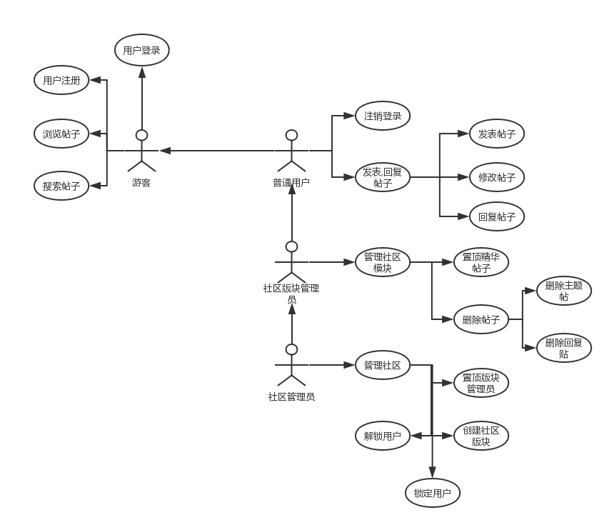
### 主要功能流程描述
#### 用户登录
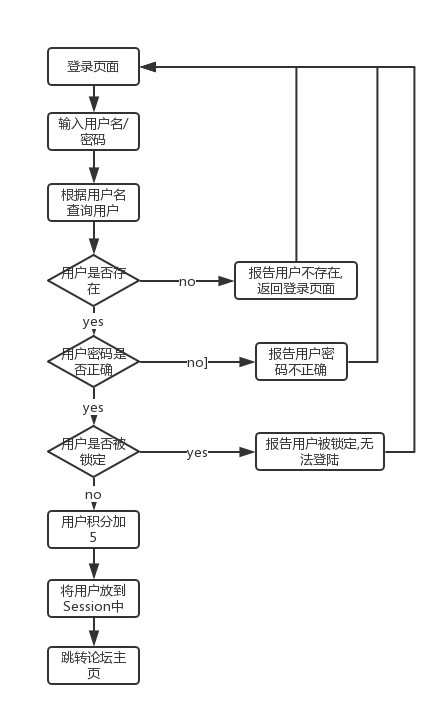
#### 发表主题帖
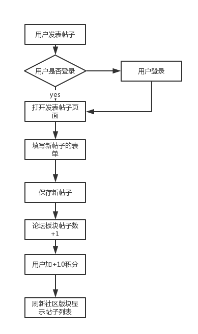
#### 回复主题帖
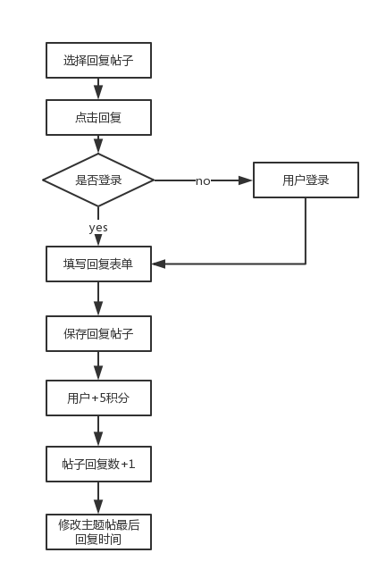
#### 删除帖子
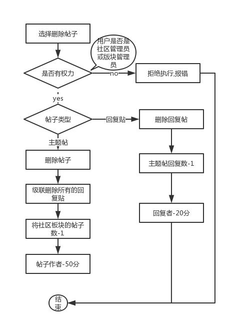
#### 置顶精华帖
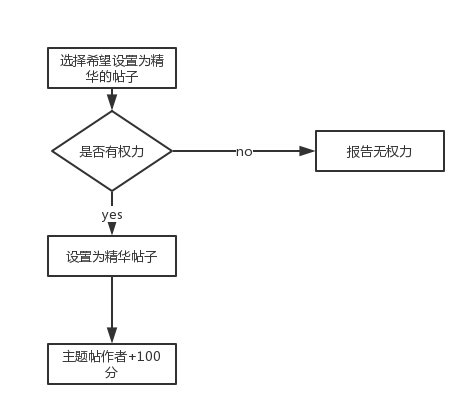
#### 指定板块管理员
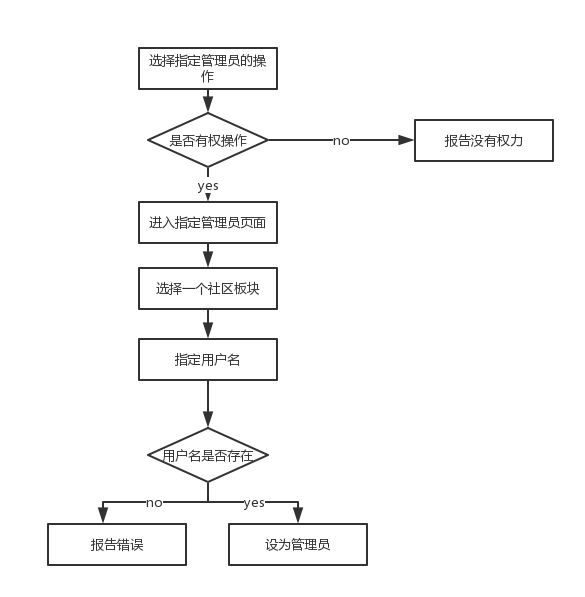

## 系统设计
Web层使用SpringMVC处理请求与响应,使用JSP视图搭配JSTL标签.并提供了一个字符转换编码过滤器防止中文乱码.服务层使用Spring4.0,持久层使用Hibernate.使用Maven构建项目.
### 系统架构
社区总共为4个模块,为用户管理,社区管理,版块管理以及社区基础功能.
* 用户管理模块分为用户注册,登录,注销.
* 论坛管理模块为创建社区板块,指定版块管理员,用户锁定与解锁.
* 版块管理模块为主题帖删除,回复主题帖,置顶精华帖.
* 社区基础功能有帖子搜索,社区板块列表,社区主题帖列表,浏览主题帖,发表主题帖,回复主题帖.

### POJO(Plain Ordinary Java Objects)设计
总共有7个PO类,BaseDomain是PO类的基类,实现Serializable接口.
* Board:社区板块PO类
* Topic:社区主题PO类,包括主题帖的作者,所属社区板块,创建时间,浏览数,回复数,mainPost对应主题帖
* Post:主题帖PO类,一个Topic拥有一个MainPost(主题帖子),但有很多个Post(回帖).
* User:用户PO类
* LoginLog:社区用户登录日志PO类
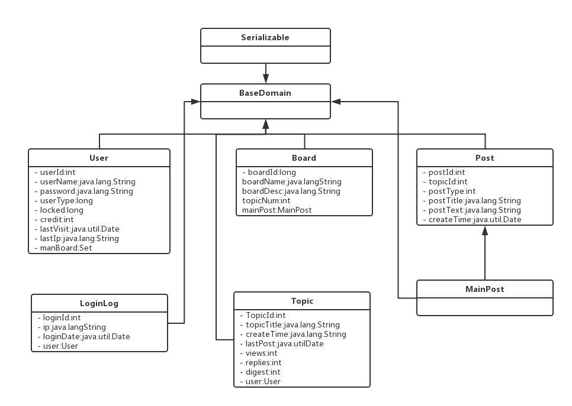
### 持久层设计
持久层采用Hibernate技术,创建所有的DAO的基类BaseDao<T>,注入Hibernate的HibernateTemplate模板.BaseDao提供了常见的数据操作方法(如增删改查),子类只需要定义自己需要的特殊方法.BaseDao<T>使用了java泛型,子类在继承时候只需要指定T的类型即可.
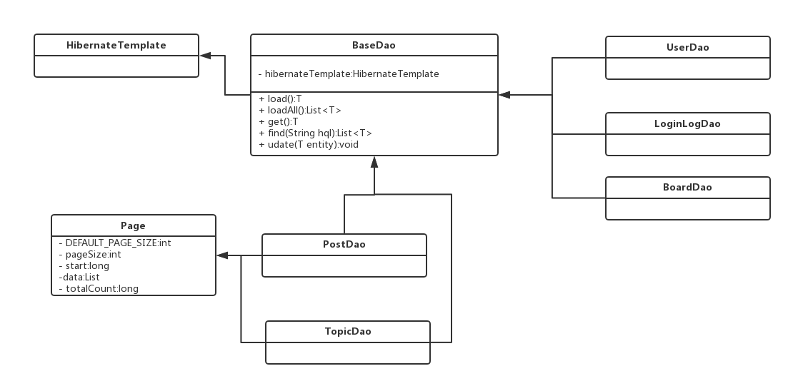
### 服务层设计
服务层通过封装持久层的DAO完成业务逻辑,Web层通过调用服务层的类来完成模块中的业务.服务层包含两个类.一个是UserService,一个是ForumService.  
UserService通过调用持久层的UserDao来实现持久化对象.提供了保存,更新,锁定,解锁用户等功能.还能依据用户名或者ID查询用户以及根据用户名模糊查询多个用户.
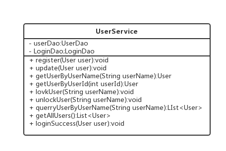
ForumService使用TopicDao,BoardDao,PostDao,UserDao实现了社区的基本功能,
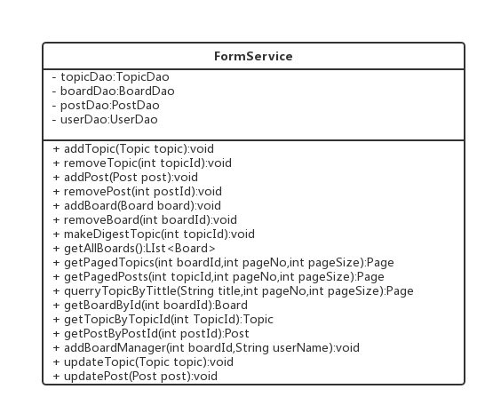
### Web层设计
在Web层定义了一个Controller的基类:BaseController,为其他Controller提供一个共有的方法.比如从Session中获取登录用户User对象,将请求转向一个URL等等.
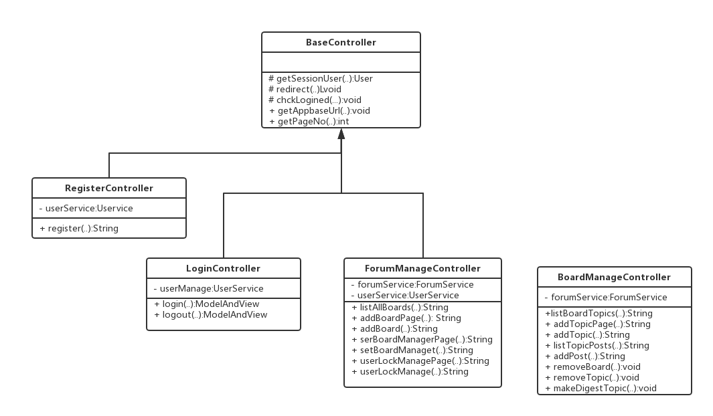
使用Spring注解MVC,一个Controller可以对应多个请求.  
* RegisterController:用户注册控制器
* LogininController:用户登录,注销控制器
* ForumManageController:社区管理控制器,包括添加社区板块,指定社区板块管理员,对用户锁定与解锁.
* BoardManageController:社区基本功能,包括发帖,回帖,删帖,置顶精华贴.

### 数据库设计:
主键使用自增机制,没有外键.只有_board_manager没有对应的POJO,他对应User与Board多对多关系,从Hibernate映射文件可以看出.

